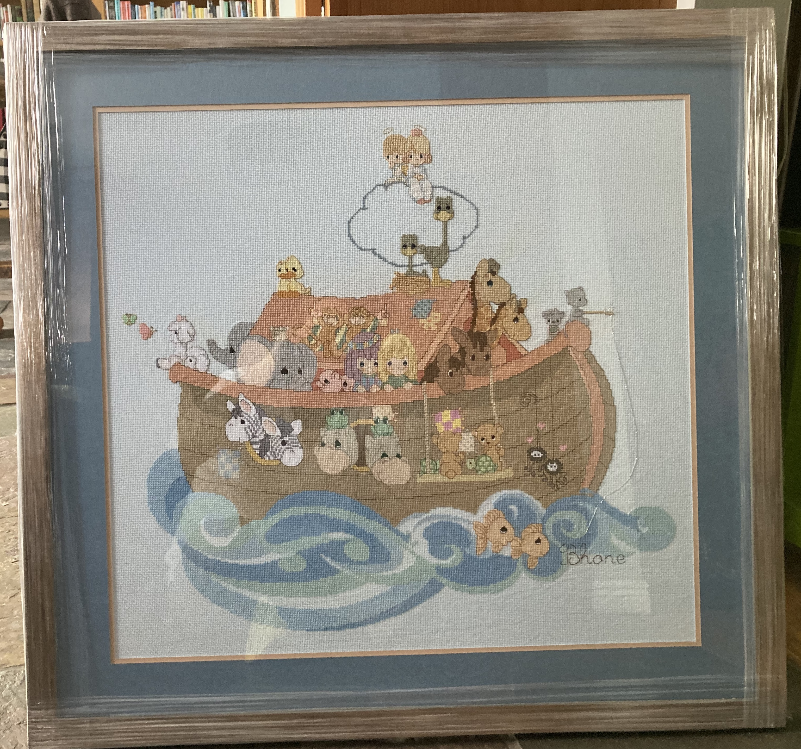

:::{.column-screen}

<!-- 
 -->
<!-- # Andrew Zieffler -->

<!-- Academic. Data lover. Statistics enthusiast. -->
<!-- 
 -->
:::

 

# Cross-Stitching

In my spare time, I really enjoy cross-stitching. Here are some of the things I have cross-stitched in the last several years.

::: {style="display: grid;grid-template-columns: repeat(auto-fill, minmax(150px, 1fr));grid-gap: 1em;"}

{group="my-gallery"}

{group="my-gallery"}

{group="my-gallery"}

{group="my-gallery"}

{group="my-gallery"}

{group="my-gallery"}

{group="my-gallery"}

{group="my-gallery"}

{group="my-gallery"}

:::

