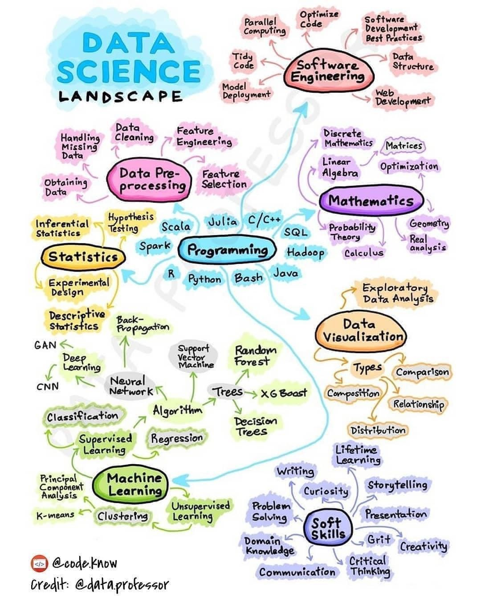

I have had this cartoon of the data science landscape sitting on my computer for several years. I don't know if still is apt, but when I saw it, I thought it was a preety good depiction of the roles and some of the skills/methods that were useful for different aspects of data science.


```{r}
#| echo: false


```

